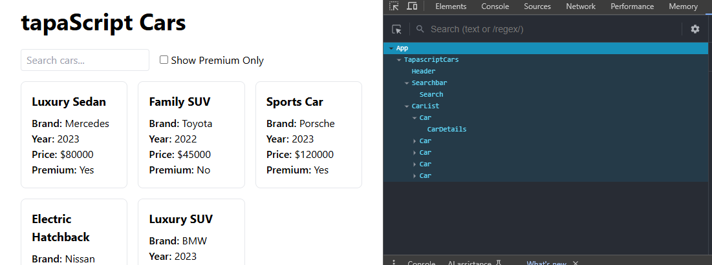

# Tapascript Cars

It is a car info app where user can see all the car details and their price. They can search a specific car to see the details. They can also see which cars fall under the premium category by checking a single checkbox.

## Table of Contents

- [Run it Locally](#run-it-locally)
- [Screenshots](#screenshots)
- [Necessary Links](#necessary-links)
- [Credit](#credit)

## Run it Locally

Please follow the below instructions to run this project in your machine:

1. Clone this repository

   ```sh
       git clone https://github.com/sagormajomder/tapascript-cars.git
   ```

2. To run below command, your machine must have install nodejs

- Install project dependencies

  ```sh
      npm install
  ```

- Run the project
  ```sh
      npm run dev
  ```

The app will be available on http://localhost:5173 by default.

## Screenshots

- UX design Diagram
  

- Component Breakdown diagram
  

- Component Hierarchy diagram
  

- React Dev Tools
  

## Necessary Links

- Repository link: [tapascript-car repository](https://github.com/sagormajomder/tapascript-cars)
- App live link : [tapascript-car live](https://tapascript-cars.netlify.app/)

## Credit

This project is a react learning purpose project guided by [tapaScript](https://github.com/tapascript)
